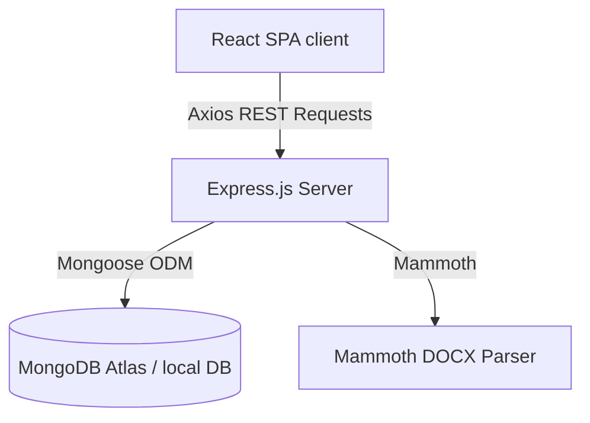

# System Architecture Documentation

This document explains the technical architecture, database schemas, access control design, and key architectural tradeoffs for SmartDocs.

## Architecture Overview

SmartDocs is built using a decoupled client-server architecture:

1. **Client (React / Vite)**: Fully client-side rendered Single Page Application styled with Tailwind CSS. It communicates with the server via an Axios client wrapper that injects authentication credentials.
2. **Server (Express / Node)**: REST API utilizing ES Modules. Routes are secured via a JWT token verification middleware.
3. **Database (MongoDB Atlas)**: Flexible document store holding records for Users and Documents.

---

## Database Design

Two primary database schemas are defined:

### 1. User Model
Stores identity and password credentials.
- `name` (String): Display name.
- `email` (String): Unique identifier, lowercase, indexed for high-performance login searches.
- `password` (String): Hashed using Bcrypt with a salt factor of 10.

### 2. Document Model
Stores document content, ownership, and user share lists.
- `title` (String): Custom title, defaults to "Untitled Document".
- `content` (String): Formatted HTML content generated directly by the Tiptap editor engine.
- `owner` (ObjectId): Reference to the creator's `User` document.
- `sharedWith` (Array of ObjectIds): Collection of reference ids of users who have been granted access.

---

## Permission Matrix & Access Control

Permissions are verified dynamically on the backend at the endpoint level:

| Action | Owner Permission | Shared User Permission | Unauthorized User |
| :--- | :---: | :---: | :---: |
| **View Document** | ✅ Allowed | ✅ Allowed | ❌ Forbidden (403) |
| **Edit Content** | ✅ Allowed | ✅ Allowed | ❌ Forbidden (403) |
| **Rename Document** | ✅ Allowed | ❌ Forbidden (403) | ❌ Forbidden (403) |
| **Share Document** | ✅ Allowed | ❌ Forbidden (403) | ❌ Forbidden (403) |
| **Delete Document** | ✅ Allowed | ❌ Forbidden (403) | ❌ Forbidden (403) |

- **Security Verification**: Every REST endpoint modifying document resources verify if `req.user._id` matches the document's `owner` or is present in its `sharedWith` array.

---

## Architectural Tradeoffs

1. **HTML Content Storage vs OT JSON**: Store content directly as raw HTML strings rather than Operational Transformation (OT) delta JSON trees.
   - *Pros*: Extreme compatibility with Mammoth docx extraction, zero server processing overhead during rendering, and easy parsing in standard rich text editors.
   - *Cons*: Cannot handle real-time concurrent character conflicts at an enterprise scale (out of scope for this prompt).
2. **Memory Buffer Multer Parsing**: Process uploaded documents in-memory rather than storing them in temporary filesystem folders.
   - *Pros*: Scalable, serverless-friendly, and eliminates cleanup cron jobs.
   - *Cons*: Restricts the maximum allowable file size (capped at 5MB).
3. **MERN Stack Choice**: Node/Express and MongoDB provide rapid schema iteration and immediate JSON compatibility, matching the fast-paced delivery needs of this document editor.
4. **Cookie-based Session Token Storage**:
   - *Pros*: Storing JWT in HTTP-Only cookies mitigates Cross-Site Scripting (XSS) risks compared to LocalStorage. Using a fallback `Authorization: Bearer` parsing logic preserves compatibility with existing integration and endpoint testing suites.
   - *Cons*: Requires cross-site cookie settings (`SameSite=None`, `Secure=true`) for production setups where the frontend and backend reside on different domains (e.g. Vercel and Render), which requires HTTPS and special conditional environment configuration to prevent breaking local HTTP development.

